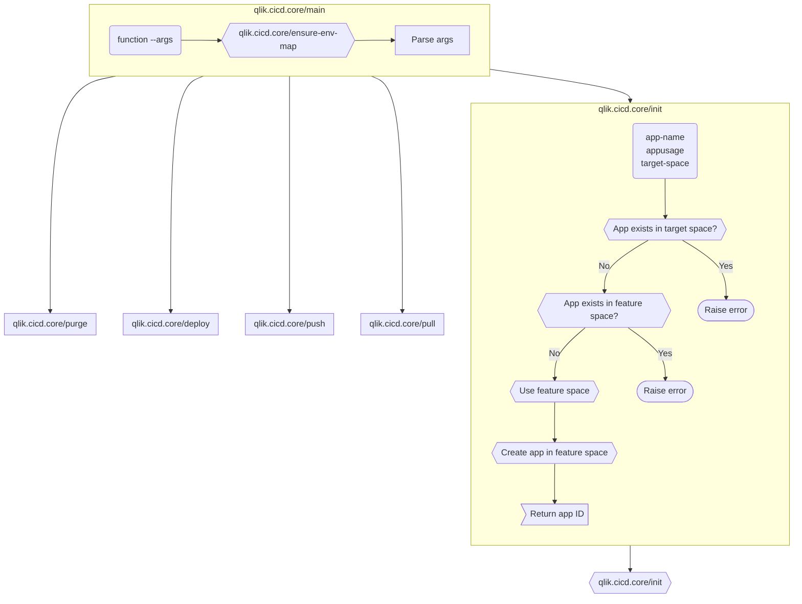

# Qlik CI/CD CLI

## Command Flows

```mermaid
flowchart TD

    subgraph main[qlik.cicd.core/main]
        main__input@{shape: event, label: "function --args"}
        main__ensure_env_map@{shape: prepare, label: "qlik.cicd.core/ensure-env-map"}
        main__parse_args@{shape: process, label: "Parse args"}

        main__input --> main__ensure_env_map --> main__parse_args
    end
    
    subgraph init[qlik.cicd.core/init]
        direction TB
        init__input@{shape: event, label: "app-name\nappusage\ntarget-space"}
        init__app_exists__target@{shape: prepare, label: "App exists in target space?"}
        init__app_exists__feature@{shape: prepare, label: "App exists in feature space?"}
        init__use_space__feature@{shape: prepare, label: "Use  feature space"}
        init__create_app@{shape: prepare, label: "Create app in feature space"}
        init__return__success@{shape: odd, label: "Return app ID"}        
        init__return__failure__target@{shape: terminal, label: "Raise error"}
        init__return__failure__feature@{shape: terminal, label: "Raise error"}

        init__input --> init__app_exists__target
        init__app_exists__target -->|No| init__app_exists__feature
        init__app_exists__target -->|Yes| init__return__failure__target
        init__app_exists__feature -->|No| init__use_space__feature
        init__app_exists__feature -->|Yes| init__return__failure__feature
        init__use_space__feature --> init__create_app
        init__create_app --> init__return__success

    end

    subgraph pull[qlik.cicd.core/pull]
    end

    subgraph push[qlik.cicd.core/push]
    end

    subgraph deploy[qlik.cicd.core/deploy]
    end

    subgraph purge[qlik.cicd.core/purge]
    end


    main --> init --> init__pull@{shape: prepare, label: "qlik.cicd.core/init"}
    main --> pull
    main --> push
    main --> deploy
    main --> purge
```