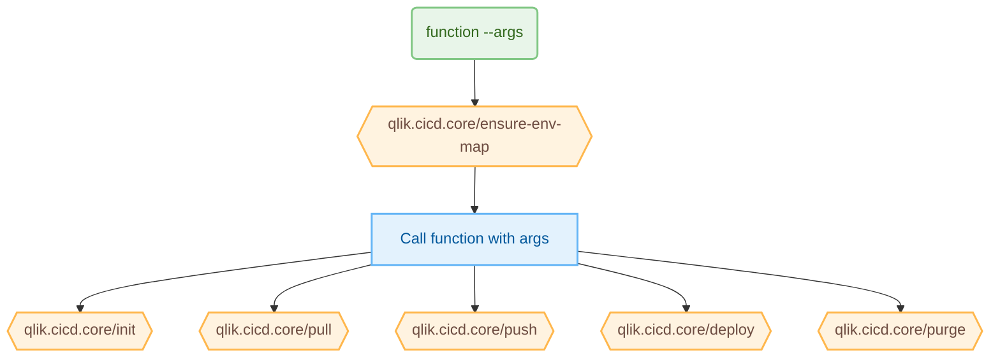

# Qlik CI/CD CLI

## Functions
### qlik.cicd.core/main

```mermaid
flowchart TD
    classDef event fill:#e8f5e9,stroke:#81c784,stroke-width:2px,color:#33691e;
    classDef prepare fill:#fff3e0,stroke:#ffb74d,stroke-width:2px,color:#6d4c41;
    classDef process fill:#e3f2fd,stroke:#64b5f6,stroke-width:2px,color:#01579b;
    classDef decision fill:#fffde7,stroke:#ffd54f,stroke-width:2px,color:#f57c00;
    classDef odd fill:#fce4ec,stroke:#f06292,stroke-width:2px,color:#ad1457;
    classDef terminal fill:#ede7f6,stroke:#9575cd,stroke-width:2px,color:#4527a0;

    input:::event@{shape: event, label: "function --args"}
    ensure_env_map:::prepare@{shape: prepare, label: "qlik.cicd.core/ensure-env-map"}
    call_function:::process@{shape: process, label: "Call function with args"}
    init:::prepare@{shape: prepare, label: "qlik.cicd.core/init"}
    pull:::prepare@{shape: prepare, label: "qlik.cicd.core/pull"}
    push:::prepare@{shape: prepare, label: "qlik.cicd.core/push"}
    deploy:::prepare@{shape: prepare, label: "qlik.cicd.core/deploy"}
    purge:::prepare@{shape: prepare, label: "qlik.cicd.core/purge"}

    input --> ensure_env_map
    ensure_env_map --> call_function
    call_function --> init
    call_function --> pull
    call_function --> push
    call_function --> deploy
    call_function --> purge
```

### qlik.cicd.core/init

```mermaid
flowchart TD
    classDef event fill:#e8f5e9,stroke:#81c784,stroke-width:2px,color:#33691e;
    classDef prepare fill:#fff3e0,stroke:#ffb74d,stroke-width:2px,color:#6d4c41;
    classDef process fill:#e3f2fd,stroke:#64b5f6,stroke-width:2px,color:#01579b;
    classDef decision fill:#e3f2fd,stroke:#64b5f6,stroke-width:2px,color:#01579b;
    classDef odd fill:#fce4ec,stroke:#f06292,stroke-width:2px,color:#ad1457;
    classDef terminal fill:#ede7f6,stroke:#9575cd,stroke-width:2px,color:#4527a0;

    input:::event@{shape: event, label: "env\napp-name\napp-usage\ntarget-space"}

    subgraph app_exists["qlik.cicd.utilities/app-exists?"]
        direction TB

        app_exists__input:::event@{shape: event, label: "env\napp-name\nspace-name"}
        
        subgraph get_space_id["qlik.cicd.api/get-space-id"]
            get_space_id__input:::event@{shape: event, label: "env\nspace-name"}
            get_space_id__api:::prepare@{shape: prepare, label: "qlik.cicd.api/call-api"}

            get_space_id__input --> get_space_id__api
        end

        is_space_id_not_null:::decision@{shape: decision, label: "not-nil?"}
        app_exists__return__false__space:::odd@{shape: odd, label: "False"}

        subgraph get_app_id["qlik.cicd.api/get-app-id"]
            get_app_id__input:::event@{shape: event, label: "env\napp-name\nspace-id"}

            subgraph list_items["qlik.cicd.api/list-items"]
                list_items__input:::event@{shape: event, label: "env\nname\nresource-type = app\nspace-id"}
                list_items__api:::prepare@{shape: prepare, label: "qlik.cicd.api/call-api"}

                list_items__input --> list_items__api

            end

            get_app_id__input --> list_items
        end

        is_app_id_not_null:::decision@{shape: decision, label: "not-nil?"}

        app_exists__return__true:::odd@{shape: odd, label: "True"}
        app_exists__return__false__app:::odd@{shape: odd, label: "False"}

        app_exists__input --> get_space_id
        get_space_id --> is_space_id_not_null
        is_space_id_not_null -->|False| app_exists__return__false__space
        is_space_id_not_null -->|True| get_app_id
        get_app_id --> is_app_id_not_null
        is_app_id_not_null -->|False| app_exists__return__false__app
        is_app_id_not_null -->|True| app_exists__return__true

    end
    get_current_branch:::prepare@{shape: prepare, label: "qlik.cicd.utilities/get-current-branch"}
    
    subgraph app_exists__feature["qlik.cicd.utilities/app-exists?"]
        app_exists__feature__input:::event@{shape: event, label: "env\napp-name\nspace-name = current-branch"}
    end

    subgraph use_space["qlik.cicd.utilities/use-space"]
        direction TB

        use_space__input:::event@{shape: event, label: "env\nspace-name = current-branch"}
        subgraph use_space__get_space_id["qlik.cicd.api/get-space-id"]
            use_space__get_space_id__input:::event@{shape: event, label: "env\nspace-name"}
            use_space__get_space_id__api:::prepare@{shape: prepare, label: "qlik.cicd.api/call-api"}

            use_space__get_space_id__input --> use_space__get_space_id__api
        end
        use_space__is_space_id_null:::decision@{shape: decision, label: "nil?"}
        use_space__return__get:::odd@{shape: odd, label: "space-id"}

        subgraph create_space["qlik.cicd.api/create-space"]
            create_space__input:::event@{shape: event, label: "env\nspace-name\nspace-type = shared"}
            create_space__api:::prepare@{shape: prepare, label: "qlik.cicd.api/call-api"}

            create_space__input --> create_space__api
        end

        use_space__return__create:::odd@{shape: odd, label: "space-id"}

        use_space__input --> use_space__get_space_id
        use_space__get_space_id --> use_space__is_space_id_null
        use_space__is_space_id_null -->|True|create_space
        use_space__is_space_id_null -->|False| use_space__return__get
        create_space --> use_space__return__create
    end

    subgraph create_app["qlik.cicd.api/create-app"]
        direction LR

        create_app__input:::event@{shape: event, label: "env\napp-name\napp-usage\nspace-id"}
        create_app__api:::prepare@{shape: prepare, label: "qlik.cicd.api/call-api"}

        create_app__input --> create_app__api
    end

    return__failure__target:::terminal@{shape: terminal, label: "Raise error"}
    return__failure__feature:::terminal@{shape: terminal, label: "Raise error"}

    subgraph pull["qlik.cicd.core/pull"]
        pull__input:::event@{shape: event, label: "env\napp-name\nspace-name"}
    end

    input --> app_exists
    app_exists -->|False| get_current_branch
    app_exists -->|True| return__failure__target
    get_current_branch --> app_exists__feature
    app_exists__feature -->|False| use_space
    app_exists__feature -->|True| return__failure__feature
    use_space --> create_app
    create_app --> pull

```